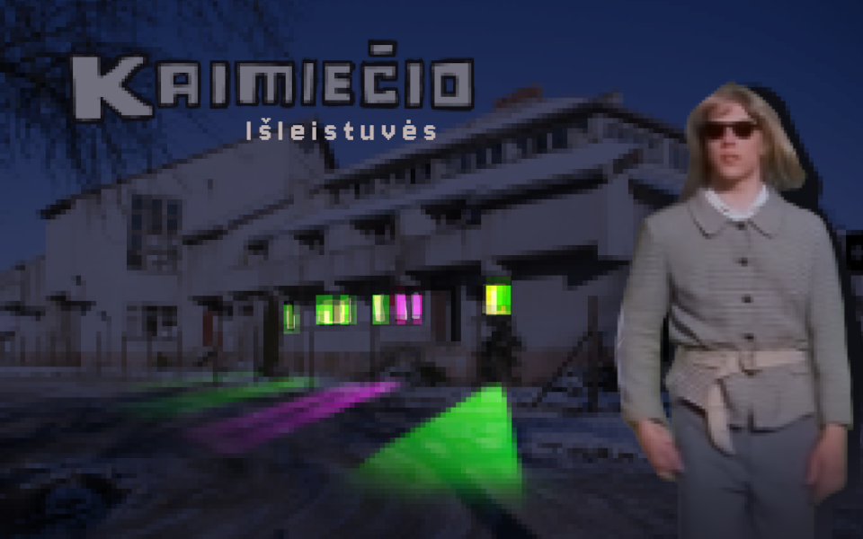
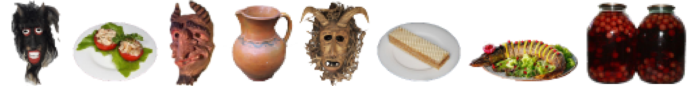

  

# Kaimiečio Išleistuvės 

## About

  

### LT

Žėk, šiandien mokyklos laidos išleistuvės, bet tavęs niekas nekvietė, nes nu - tu lopas. Iškalba nepasižymi, plius - dar ir iš kito kaimo. Pasislėpęs po akiniais ir geriausiais tėvo rūbais neišsiduok, gal pritapsi ir išgert gausi. O jei ne - makufelį daužys tau gezai. Nusimato įdomus vakaras!

### EN

Look, today’s the school prom, but nobody invited you ’cause, well—you’re a loser. Zero social game, and worse, you’re from a different village. Infiltrate, hide behind your shades and your dad’s best drip. Crush it and score drinks, or kiss the carpet. No matter what, it’s gonna be a wild night.

  

## Global Game Jam 2026

This game was developed as a part of [Global Game Jam 2026 in Kaunas](https://globalgamejam.org/games/2026/kaimiecio-isleistuves-4), where the theme was "Mask".

  

The team behind this game:

- [Gustas Kažukauskas](https://github.com/PunkPun)
- [Edvinas Danevičius](https://edvinas.dev)
- [Teresė Žvinakevičiūtė](https://www.instagram.com/teresesutkus/)
- [Rokas Sutkus](https://www.instagram.com/sutkusaudio/)
- [Dovydas Reitelaitis](https://www.instagram.com/reitelaitis/)

## Links

- [Watch Trailer On YouTube](https://www.youtube.com/watch?v=Ie_HjKzRgVU)
- [Download latest release](https://github.com/Edvinas01/ggj-2026/releases/latest)
- [Play on itch.io](https://rieves.itch.io/kaimiecio-isleistuves)

## Development

- Unity [Unity 6000.3.3f1](unityhub://6000.3.3f1/ef04196de0d6)
- [GitHub Desktop](https://desktop.github.com/download/) or [Git Bash](https://git-scm.com/downloads)
- [Rider](https://www.jetbrains.com/rider) or [Visual Studio](https://visualstudio.microsoft.com)
- [FMOD Studio 2.03](https://www.fmod.com/download) (optional)
